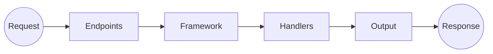
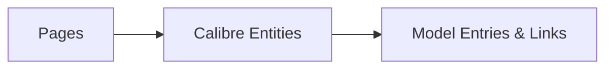

# COPS Architecture & Design (2.7.x and later)

## Introduction

COPS has been around for ages, and it was developed before PHP architecture patterns and frameworks were in common use.

This can lead to some "strange" things in the way COPS is organized and how it handles web pages. For example, all the Pages below can be generated server-side by the HtmlRenderer or handled client-side with data from the JsonRenderer, and they both use a common set of Templates for most pages.

This Wiki page documents how COPS has been re-structured over the past few years and prepare for the future...

## Design Principles

Every product is based on goals, design principles, choices and preferences that may not always be clearly stated. This fork tries to stay true to the original [goals and design principles](https://github.com/seblucas/cops#why-) from @seblucas

- HTML / OPDS content server for Calibre (read-only)
- simple tool to be installed on a small server (PHP)
- support modern web browsers *and* old e-readers
- do not try to replace all functionality available in Calibre

## Overall Architecture

The overall flow to handle a request and prepare a response now looks like this:



The HTML/JSON and OPDS Output is still organized in Pages, each related to Calibre entities, and mapped to a common entry/link Model. These models are then enriched and rendered as needed for all HTML/JSON pages or OPDS feeds.



## Framework, Input & Routing

The Framework was introduced in COPS 2.7.0 to move all custom code from the Endpoint scripts to dedicated Handlers.

Endpoint scripts in COPS 2.7.x all shared the same minimal code:
```php
use SebLucas\Cops\Framework;

require_once __DIR__ . '/config.php';

Framework::run('...');
```
and they only differentiate by the `name` of the handler to be called. With COPS 3.1.x this code is replaced with a redirect to `index.php/name` and they are permanently removed in release 3.3.1.

Within the Framework, the run() method is equally simple and basically covers the following steps:
1. get Request based on input + use Routing (3.4.x) to find parameters
2. match Request to the right Handler based on name and Route
3. create Handler
4. let Handler handle the Request
5. send back the Response (3.2.x)

In COPS 2.x both old-style URL parameters (getJSON.php?page=...&id=...) and new-style Route URLs (/authors/...) are supported by the Framework.

COPS 3.x enables Route URLs by default. This gives us nicer-looking URLs, and it allows us to use a single front controller. Support for generating old-style URLs is removed in release 3.4.x.

## Endpoints, Handlers & Output

Name | 2.x Endpoint | Handlers | Output | Pages
-----|--------------|----------|--------| -------
index | index.php | HtmlHandler | HtmlRenderer | yes
json | getJSON.php | JsonHandler | JsonRenderer | yes
feed | feed.php | FeedHandler | OpdsRenderer | yes
fetch | fetch.php | FetchHandler | FileRenderer | -
read | epubreader.php | ReadHandler | EPubReader | -
epubfs | epubfs.php | EpubFsHandler | = | -
zipfs | zipfs.php | ZipFsHandler | = | -
... | | | | 
restapi | restapi.php | RestApiHandler | RestApi | partial

All Handlers have a static `getRoutes()` method to define the Routes they support with the Framework.

Their `handle($request)` method will analyze the Request parameters and call the Output renderer to prepare the Response.

With Handlers using Pages, the current page is retrieved to be rendered further:
```php
$currentPage = PageId::getPage($page, $request);
```

## Routes, Pages & Calibre

Route | PAGE_ID | Page # | Pages | Calibre
------|---------|--------|-------|--------
/index | INDEX | index | PageIndex | *
/authors | ALL_AUTHORS | 1 | PageAllAuthors | BaseList[Author]
/authors/{id} | AUTHOR_DETAIL | 3 | PageAuthorDetail | Author
/books | ALL_BOOKS | 4 | PageAllBooks | BookList
/books/{id} | BOOK_DETAIL | 13 | PageBookDetail | Book
... | 

Routes for Pages are defined in `PageHandler::getRoutes()` and used by both `HtmlHandler` and `JsonHandler`.
Other routes are defined in the corresponding handlers.

The PAGE_ID and page=... values are defined in `PageId` and correspond to one of the Pages. Pages cover a particular Calibre entity like Author, Book etc. or a list of entities. Generic features like About or Customize are handled by their own Pages. 

The Pages will use the `getEntries()` method to collect all the entries that will then be Output by the `HtmlRenderer`, `JsonRenderer` or `OpdsRenderer`.

## Entry & Link Model

The Entry and Link Model was initially meant to map Calibre entities to a common model aligned with the [OPDS Catalog 1.2](https://specs.opds.io/opds-1.2) specification.

This makes a distinction between **Navigation** feeds where entries point to other feeds, and **Acquisition** feeds where entries refer to a particular book.

And each link in both feeds and entries must have a particular **type**, that identifies whether it points to a navigation or acquisition feed, to an acquisition (download), or an image, thumbnail etc.

The Pages above will return an array of entries that are either `Entry` (e.g. ALL_AUTHORS has entries for AUTHOR_DETAIL) or `EntryBook` (e.g. AUTHOR_DETAIL has entries for BOOK_DETAIL). And each Entry has an array of links of a type that refers to a feed, download, image, related items etc.

The `OpdsRenderer` will then turn this into an OPDS 1.2 compliant XML Output - happy ending to all :-)

When COPS needs to generate HTML/JSON output things get a bit more complicated, as people want to see more than OPDS links & entries in their browser.
So `JsonRenderer` starts enriching these with more data from the original Calibre entities, and you get some weird Model in the middle that only makes sense for OPDS - not so happy ending :-(

TODO

## Templates

After the initial page, COPS will generate web pages server-side or client-side (with HtmlRenderer or JsonRenderer). The choice will depend on the user agent of the browser:
- older devices and e-readers will use **server-side** rendering with PHP in `HtmlRenderer`
- modern browsers will use **client-side** rendering with Javascript in [util.js](https://github.com/mikespub-org/seblucas-cops/blob/main/util.js) and `JsonRenderer`.

COPS supports 2 template engines: doT & Twig. They both support client-side and server-side rendering thanks to ported libraries, but [doT](https://github.com/olado/doT) was developed with client-side Javascript and is frozen since 2020, while [Twig](https://twig.symfony.com/) was developed with server-side PHP and is still quite active.

With both template engines, the initial page template is rendered server-side by `HtmlRenderer` using `DotPHPTemplate` or `TwigTemplate`, and all other template files are then included and rendered client-side or server-side.

Users can choose between different sets of templates, and they may support different styles within a template set. If you want to develop or customize templates, the `twigged` template explains the difference in doT and Twig syntax in its [README.md](https://github.com/mikespub-org/seblucas-cops/blob/main/templates/twigged/README.md)

The template syntax used in the COPS templates is deliberately limited to ensure compatibility. The main difference in how doT and Twig template sets are used is [template inheritance](https://twig.symfony.com/doc/3.x/templates.html#template-inheritance) (extends), something that doT doesn't really support but is a core feature for Twig templates.

## Other Interfaces

Besides the HTML and OPDS interface, COPS also supports the following interfaces:

1. JSON Interface

This is used internally by COPS for client-side rendering of all Page routes. You can use it directly in scripts, widgets or web pages by using an `Accept: application/json` header with the request.

```sh
$ curl -H 'Accept: application/json' http://localhost/cops/index.php/authors/1  # or  http://localhost/cops/authors/1
```

2. OPDS 2.0 Feeds (dev only)

With `/index.php/opds` instead of `/index.php/feed` you'll get OPDS 2.0 (JSON) feeds instead of OPDS 1.2 (XML) ones to browse OPDS catalogs on your e-reader.

3. REST API

With `/index.php/restapi/` you'll see the OpenAPI Specification for the REST API of COPS (Swagger UI). In addition to the Page routes above, you'll also have access to *special* routes like notes, annotations and preferences, along with *utility* routes for listing routes, pages, database tables etc.

For REST API access to *other* handlers you'll need to set an API key in `$config['cops_api_key']` and send it along with the request.

```sh
$ curl -H 'X-API-KEY: myApiKey' http://localhost/cops/index.php/restapi/fetch/...
```

4. GraphQL Interface (dev only)

With `/index.php/graphql` you'll see the GraphiQL playground to explore the GraphQL schema for COPS. This gives you access to most data in the Calibre database, and allows you to retrieve exactly the data you want with custom queries like [test.query.graphql](https://github.com/mikespub-org/seblucas-cops/blob/main/tests/graphql/test.query.graphql)

## Dependencies

COPS requires both [PHP packages](https://packagist.org/) and [NPM assets](https://www.npmjs.com/) which are defined in [composer.json](https://github.com/mikespub-org/seblucas-cops/blob/main/composer.json) using [Asset Packagist](https://asset-packagist.org/)

- PHP Packages
  - mikespub/epubjs-reader for the epub.js reader
  - mikespub/php-epub-meta to open EPUB files
  - nikic/fast-route for URL routing
  - phpmailer/phpmailer to send mail to Kindle
  - twig/twig to support Twig templates
- NPM Assets
  - bootstrap 3
  - dot
  - jquery
  - js-cookie
  - lru-fast
  - magnific-popup
  - normalize.css
  - corejs-typeahead
  - twig
- Via CDN in templates
  - bootstrap 5
  - swagger-ui-dist
- Local Resources
  - monocle
  - seblucas/dot-php
  - simonpioli/sortelements

In development mode, some additional packages are used:

- PHP Packages
  - kiwilan/php-opds for OPDS 2.0 feeds
  - mikespub/epub-loader to search information on books, authors etc.
  - webonyx/graphql-php for the GraphQL interface
- Via CDN in templates
  - datatables.net with datatables.net-bs5
  - graphiql with react, react-dom and graphql
